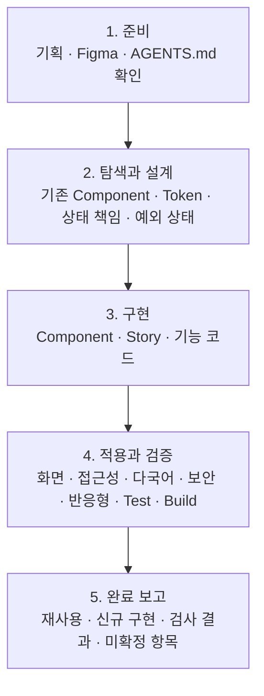
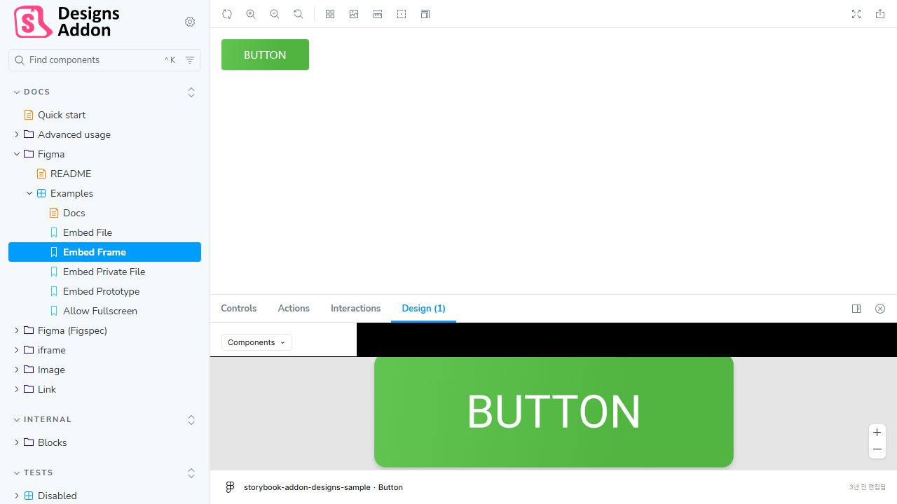
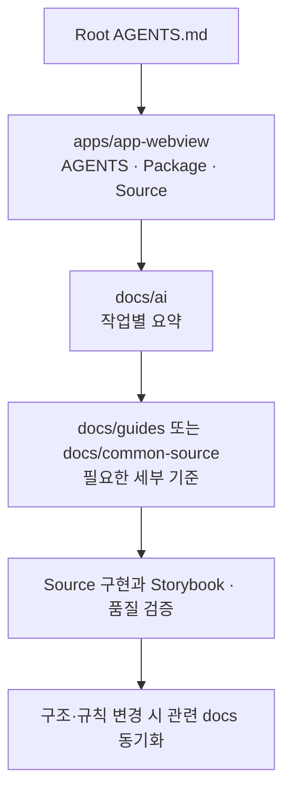

# Lounge Front-end 구축 가이드 브리핑

## 1. 브리핑 목적

이 문서는 Lounge Front-end를 실제로 구축하고 운영할 개발자에게 현재 정리된 기술 기준, 작업 순서와 완료 판단 기준을 설명합니다.

이번 브리핑은 특정 화면의 상세 기획이나 API 계약을 확정하는 문서가 아닙니다. 개발자가 코드를 어디에 배치하고, 기존 Component를 어떻게 찾으며, 서버 상태와 Client 상태를 어떻게 구분하고, 어떤 검증을 거쳐 작업을 완료할 것인지 공유하는 문서입니다.

목표는 개발자나 AI 도구가 바뀌어도 같은 기준으로 구현하고 검토할 수 있게 만드는 것입니다. 설치된 Package, 기존 Source와 확정된 프로젝트 계약을 가이드보다 우선하여 확인합니다.

## 2. 구축 대상과 저장소 구조

WebView 서비스 화면과 업무 흐름은 `apps/app-webview`에 구현합니다.

```text
apps/
└── app-webview/             # App에서 사용하는 WebView 서비스 화면
```

`apps/app-webview` 안에서는 Routing과 화면 진입점, 기능 코드와 WebView 전용 UI를 가까운 위치에서 관리합니다. App-WebView 한 곳에서만 사용하는 shadcn/ui 원형과 Wrapper는 `apps/app-webview/src/components/ui`에 둡니다.

여러 기능에서 실제로 재사용되고 의미와 변경 이유가 같은 UI만 `src/components/ui`에서 공통으로 관리합니다. 한 화면에서만 사용하는 Wrapper, 공통화 가능성을 예상한 Type과 Adapter는 미리 만들지 않습니다.

`apps/`와 `docs/`의 최상위 분리는 실제 프로젝트 기준입니다. 앱 내부 Package 경계와 Build 구성은 실제 사용처와 현재 설정을 기준으로 판단합니다. 구조를 바꿀 때는 한 기능의 변경이 여러 Application과 Package에 불필요하게 퍼지지 않는지 확인합니다.

상세한 저장소 경계와 공통화 기준은 [Front-End 저장소 구조 기준](../architecture/index.html)에서 확인합니다.

## 3. 기능 하나를 구현하는 기본 순서

개발자는 화면을 바로 작성하기 전에 다음 순서로 작업 범위와 기존 구현을 확인합니다.

1. 기획과 Figma에서 화면 목적, 상태, 입력과 사용자 동작을 확인합니다.
2. 실제 프로젝트의 `AGENTS.md`와 작업 종류에 해당하는 AI 요약 문서를 확인합니다.
3. Figma Component Description에 연결된 파일 이름과 경로를 확인합니다.
4. 실제 코드에서 Component의 Export, Props, Variant와 사용처를 다시 확인합니다.
5. 기존 Layout, 디자인 토큰, shadcn/ui와 프로젝트 Component로 표현할 수 있는 범위를 판단합니다.
6. 서버 데이터, Form, 화면 내부 상태와 공유 Client 상태의 소유 도구를 구분합니다.
7. 정상 결과뿐 아니라 Loading, Empty, Error, 느린 응답과 연결 끊김 상태를 함께 설계합니다.
8. 독립적으로 재현·검토할 가치가 있는 Component, 기능 조합이나 화면 상태라면 실제 구현과 Story를 같은 변경에서 작성합니다.
9. 화면에 적용하고 접근성, 반응형, 상태 전환과 주요 사용자 동작을 검증합니다.
10. TypeScript 검사, Lint, Test, Storybook 정적 Build와 Application Build 중 프로젝트에 실제로 구성된 검사를 실행합니다.
11. 재사용한 Component, 새로 만든 Component, 추가·변경한 Story와 재현 상태, 검증 결과와 확인하지 못한 항목을 완료 보고에 남깁니다.

위 순서는 다음 다섯 단계로 이해할 수 있습니다.



준비 단계에서는 요구사항과 기존 구현을 찾고, 탐색과 설계 단계에서는 새로 만들 범위와 상태 소유를 결정합니다. 구현 단계에서 Component와 Story 또는 기능 코드를 작성하고, 실제 화면에 적용한 뒤 품질 기준을 검증합니다. 마지막에는 완료한 내용뿐 아니라 검증하지 못한 환경과 남은 계약도 함께 보고합니다.

API Endpoint, 요청·응답 필드와 오류 계약이 아직 승인되지 않았다면 임의의 API, Parser, Fixture와 Mock Handler를 먼저 만들지 않습니다. 필요한 계약을 `TBD`로 남기고 Backend가 전달한 승인된 형식을 받은 뒤 연결합니다.

파일 배치, 기술 스택, 상태와 품질의 전체 기준은 [Front-End 개발 가이드](../frontend/index.html)에서 확인합니다.

## 4. UI 구현과 Figma 연결

### 디자인 토큰과 기존 Component를 우선합니다

색상, 글자, 간격, Radius와 상태 표현은 Figma 값이나 임의의 Tailwind Utility를 화면마다 복사하지 않고 프로젝트의 Semantic Token을 우선 사용합니다.

Button, Input, Dialog처럼 공통 Component가 이미 존재하면 새 JSX를 작성하지 않고 기존 공개 API로 구현합니다. shadcn/ui는 외부 Package를 그대로 호출하는 완성품이 아니라 프로젝트가 소유하고 수정하는 Component Source로 취급합니다.

기존 Component로 요구사항을 표현할 수 없다면 다음 순서로 판단합니다.

1. 기존 Props나 Variant로 표현 가능한지 확인합니다.
2. 기존 Component의 의미를 해치지 않는 확장인지 검토합니다.
3. 한 기능에만 필요한 조합이면 기능 가까이에 둡니다.
4. 여러 화면에서 의미와 변경 이유가 같을 때 공통 Component로 승격합니다.
5. Storybook만을 위해 사용하지 않는 Props, Variant와 Wrapper를 추가하지 않습니다.

### Figma에 실제 구현 정보를 남깁니다

Figma Main Component의 Description에는 다음 정보를 기록합니다.

- 실제 Component 이름
- 실제 파일 경로 또는 Import 경로
- 주요 Props와 Variant
- 지원하는 상태와 사용 제한
- 대체하거나 우선 사용해야 하는 기존 Component
- 실제 Source 또는 Storybook에 접근 가능한 경우 Dev resource 링크

구축 기간에는 디자인 편집 권한이 있는 담당자가 정보를 작성합니다. 운영 단계에는 Front-end 개발자가 Component 경로, Props 또는 지원 상태를 변경했을 때 Figma 설명도 함께 갱신합니다. Dev Mode는 정보를 확인하는 용도이며 Description 편집에는 디자인 편집 권한이 필요합니다.

Code Connect를 사용하지 않더라도 이 정보를 통해 개발자와 AI가 기존 구현을 찾을 수 있습니다. 다만 Figma 설명은 실제 코드의 존재와 API를 보장하지 않으므로 반드시 Source를 다시 확인합니다.

Figma 구현 흐름은 [React Code Exports 가이드](../ui/react_code_exports.html), Semantic Token은 [디자인 토큰 가이드](../ui/design_tokens.html)에서 확인합니다.

## 5. Storybook을 이용한 UI 개발과 검증

Storybook은 공통 Component만 만들거나 전시하는 공간이 아닙니다. Application 전체를 실행하지 않고도 Component, 기능 조합과 의미 있는 화면 상태를 격리해 재현하고, 구현·디자인 Review, 접근성, Interaction과 시각 회귀 검증에 사용하는 UI 개발 환경입니다.



> [`@storybook/addon-designs` 공식 Embed Frame 데모](https://storybookjs.github.io/addon-designs/?path=/story/docs-figma-examples--embed-frame)를 직접 캡처한 화면입니다. 각 Story에는 Figma 파일, Frame 또는 Prototype URL을 연결할 수 있으며 Storybook의 `Design` 탭에서 Embed 결과를 확인합니다. 특정 Frame 링크에는 해당 Frame의 `node-id`가 포함됩니다.

### Story 작성 대상을 선택합니다

Story는 파일 종류가 아니라 독립 재현과 검토 가치로 판단합니다. 다음 대상은 Story 작성을 우선 검토합니다.

- 여러 화면에서 사용하는 공통 Component와 주요 Variant
- Form, 검색 조건, Dialog와 단계형 흐름처럼 상태 전환이 중요한 기능 조합
- Loading, Empty, Error, 권한 거부, Offline과 긴 응답처럼 실제 환경에서 반복 재현하기 어려운 화면 상태
- 긴 문구, 다국어, 좁은 Viewport, Theme과 접근성 검토가 필요한 Layout 또는 화면 구간
- 과거 장애나 회귀 위험이 있어 고정된 재현 조건이 필요한 UI

단순 Page Wrapper, Router만 연결하는 진입점, Story 안에서 실제 서비스와 동일하게 만들 수 없는 Backend 통합은 대상에서 제외할 수 있습니다. 화면 전체를 Story로 만들기 위해 업무 로직을 복제하지 않습니다.

### Component와 기능 상태를 구현하는 경우

1. 실제 Component, 기능 조합 또는 화면 구간을 Application Source에 구현합니다.
2. 같은 변경에서 검토할 상태를 Story로 구성합니다.
3. Args, Decorator와 승인된 Mock 경계를 사용해 입력, Context, Viewport와 서버 상태를 제어합니다.
4. Default, Disabled, Loading, Empty, Error, 긴 문구, 다국어와 필요한 화면 크기를 확인합니다.
5. Play 또는 합의된 Test로 Keyboard Focus, 접근 가능한 이름과 주요 사용자 Interaction을 확인합니다.
6. 디자인 검토와 시각 회귀 기준이 필요한 상태는 고정된 데이터와 결정적인 결과를 유지합니다.
7. Storybook에서 검증한 구현을 실제 화면에 적용하고 Application 통합 검증을 별도로 수행합니다.

### Storybook이 대신하지 않는 검증

Storybook은 실제 Routing, Backend 권한과 업무 규칙, WebView Bridge, 배포 환경, 실제 Browser Network와 전체 사용자 여정을 보장하지 않습니다. Story의 Mock은 승인된 계약을 재현하는 검증 도구이며 API 계약을 새로 정의하는 근거가 아닙니다. 이 항목은 Application Test, 통합 Test, E2E와 실제 기기 검증으로 확인합니다.

### Storybook 반자동 운영

Storybook은 Component 전시장이나 별도의 문서 작성 업무가 아니라 Component, 기능 조합과 화면 상태를 재현하는 UI 구현·검증 환경입니다.

AI는 다음 반복 작업을 우선 수행할 수 있습니다.

- 공통 UI, 기능 조합과 중요 화면 상태를 비교하여 Story 누락 후보 찾기
- 기존 Story 형식에 맞는 Story 초안 작성
- Props, Context, Mock 계약과 상태 변경에 따른 Story 갱신 후보 찾기
- Storybook 정적 Build, Story 렌더링, Interaction, 접근성과 시각 회귀 중 합의된 검사 실행
- 추가한 Story, 재현한 상태, 사용한 Mock 경계와 실패 항목 정리

개발자는 Story 작성 대상인지, 실제 지원 상태와 계약이 맞는지, Figma와 결과가 일치하는지, 접근성, Interaction과 Application 통합 결과가 충분한지 검토합니다. AI가 만든 Story도 사람이 작성한 코드와 같은 Review와 검증을 거칩니다.

Storybook 정적 Build를 필수 검사로 사용합니다. Story 렌더링, Interaction, 접근성과 시각 회귀 검사는 실제 `package.json`과 Workflow에 구성된 범위에서 실행하며, 존재하지 않는 명령이나 CI 구성을 추측하지 않습니다.

Story 대상, AI 요청 예시, 누락 점검과 완료 기준은 [Storybook 운영 가이드](../storybook/index.html)에서 확인합니다.

## 6. 상태와 데이터의 책임

상태는 편의가 아니라 데이터의 출처와 소유 범위에 따라 도구를 선택합니다.

| 상태 종류 | 기본 도구 | 적용 기준 |
| --- | --- | --- |
| 한 Component 내부의 일시적인 UI 상태 | React 지역 상태 | 열림, 선택, Hover와 같이 가까운 UI에서만 사용하는 상태 |
| URL로 공유하거나 복원해야 하는 상태 | URL Search Params 또는 Route | 검색 조건, Tab과 페이지처럼 주소로 표현할 상태 |
| 입력, 검증과 제출 상태 | React Hook Form | 하나의 Form 단위로 관리할 입력과 오류 |
| 서버에서 조회하거나 변경하는 데이터 | TanStack Query | Cache, 갱신, 실패와 재시도가 필요한 서버 상태 |
| 여러 화면이 공유하는 Client 상태 | Zustand | 서버 원본이 아닌 공유 UI·Client 상태 |

서버에서 받은 데이터를 Zustand에 다시 복제하지 않습니다. 서버 상태는 TanStack Query의 Cache와 무효화 정책으로 관리합니다.

Zustand는 여러 화면이 공유해야 하는 Client 상태가 실제로 확인됐을 때 사용합니다. 하나의 Component나 한 화면에서만 사용하는 상태는 지역 상태로 유지합니다.

React Hook Form은 Form 상태를 관리하는 도구이며 업무 규칙과 Backend 검증을 대신하지 않습니다. Schema 검증 도구, 서버 오류 매핑과 제출 정책은 실제 프로젝트 계약이 정해진 뒤 확정합니다.

전체 상태 소유 기준은 [Front-End 개발 가이드](../frontend/index.html), Zustand의 Store와 Persist 기준은 [Zustand UI 상태 관리 가이드](../ui/zustand.html)에서 확인합니다.

## 7. 서버 통신과 비동기 화면

API 계약이 승인된 뒤 공통 요청 함수와 기능별 응답 검증 경계를 연결합니다. Front-end는 API 응답과 외부 값을 화면에 사용하기 전에 필요한 형태와 허용 값을 방어적으로 확인합니다. 요청 데이터의 신뢰성, 권한과 업무 규칙은 Backend가 다시 검증하며 Front-end 검증 결과를 신뢰 근거로 사용하지 않습니다.

서버 통신 화면은 최소한 다음 상태를 구분합니다.

- 최초 조회 Loading
- 기존 데이터를 유지한 갱신 상태
- 결과가 없는 Empty 상태
- 사용자 재시도가 가능한 Error 상태
- 느린 응답 중 중복 제출 방지와 진행 안내
- 연결이 끊긴 상태와 다시 연결됐을 때 갱신

모든 요청에 같은 Timeout과 Retry를 적용하지 않습니다. 조회와 변경 요청, 멱등성, 업무 위험도를 기준으로 기능별 정책을 결정합니다. 결제·예약처럼 중복 실행 위험이 있는 작업은 Front-end 재시도만으로 안전하다고 판단하지 않습니다.

Backend의 지연·오류 환경을 미리 가정하지 않습니다. 승인된 계약이 있고 실제 환경에서 상태 재현이 어렵다면 MSW 같은 Front-end 테스트 도구를 선택적으로 검토합니다. MSW는 API 계약을 임의로 만드는 도구가 아닙니다.

Loading, Timeout, Retry, Offline과 측정 방법은 [네트워크 지연 대응 및 성능 검증 가이드](../performance/index.html)에서 확인합니다.

## 8. WebView와 Native App 경계

예약, 결제, 콘텐츠와 같은 서비스 업무 화면은 WebView에서 제공합니다. Camera, 위치, Push, Device 권한처럼 Native 기능이 필요한 경우에만 승인된 JavaScript Bridge를 호출합니다.

화면 Component가 Flutter 객체나 OS별 메시지 형식을 직접 다루지 않도록 Bridge Adapter를 둡니다. Adapter는 요청 ID, Method, Parameter와 결과 형식을 일관되게 처리하고 화면에는 Promise 기반의 최소 API를 제공합니다.

Bridge 구현 전에는 Flutter 담당자와 다음 계약이 필요합니다.

- Flutter Native App이 검증할 허용 Origin과 호출 가능한 Method
- Request와 Response 메시지 형식
- 성공, 취소, 권한 거부, Timeout과 오류 구분
- 중복 요청과 화면 종료 시 처리
- iOS와 Android의 지원 범위

Bridge는 인증 Token을 전달하거나 Backend 권한 검증을 우회하는 수단으로 사용하지 않습니다. 업무 데이터의 최종 상태와 권한 판단은 승인된 Backend 계약을 기준으로 합니다.

Native·WebView 책임은 [APP 개발 표준](../app/app.html), Bridge 계약과 구현은 [WebView 개발 가이드](../platform/webview/webView_guide.html)에서 확인합니다.

## 9. Browser, OS와 반응형 기준

반응형 웹은 Tailwind CSS v4를 유지하면서 Safari 15와 같은 구형 Browser를 지원합니다. 공식 완전 호환 버전이 아니라 프로젝트가 사용하는 CSS와 Utility의 실제 동작을 기준으로 다음 버전을 검토합니다.

- Chrome·Edge 지원 대상 구형 버전
- Safari 15 이상
- Firefox 지원 대상 구형 버전
- Samsung Internet 지원 대상 구형 버전

공통 CSS 하한은 Safari 15에서 지원되는 기능 범위로 정합니다. Android와 다른 Browser는 Safari 버전에 특정 제품 버전을 기계적으로 대응시키지 않고, 주요 구형 버전과 최신 안정 버전에서 실제 사용하는 Tailwind Utility와 핵심 기능을 확인합니다. 지원 환경에서 동작하지 않는 최신 CSS 기능은 사용하지 않거나 대체합니다.

주요 서비스 국가인 한국, 중국, 일본과 미국 및 전 세계 Browser 점유율은 지원 범위를 설명하는 보조 근거로 사용합니다. 제품군 점유율을 특정 최소 버전 이상의 정확한 사용자 비율로 해석하지 않습니다.

최근 Browser는 대부분 자동 업데이트되지만 기업 관리 기기, 장기 미재시작, 구형 OS와 WebView는 업데이트가 늦을 수 있습니다. 운영 데이터가 확보되면 실제 사용자 Browser와 OS 분포를 기준에 다시 반영합니다.

반응형 화면은 물리 해상도가 아니라 CSS Viewport로 구분합니다.

| 구간 | CSS Viewport | 주요 확인 항목 |
| --- | --- | --- |
| Mobile | 320~767px | 입력, 터치 영역, 긴 문구, 고정 UI와 가로 Overflow |
| Tablet | 768~1023px | 열 전환, 세로·가로 방향과 콘텐츠 밀도 |
| PC | 1024px 이상 | 최대 콘텐츠 너비, 다단 Layout과 넓은 화면 확장 |

대표 너비만 확인하지 않고 767·768px, 1023·1024px 같은 경계값을 함께 검증합니다. 지원 Browser에서 사용하지 못하는 CSS 기능은 사용하지 않거나 동등한 Fallback을 제공하며, Tailwind CSS v4를 사용한다는 이유만으로 모든 최신 CSS 기능을 허용하지 않습니다.

Browser 점유율과 대표 너비는 [반응형 웹 Browser 지원 가이드](../browser-support/index.html), App WebView 최소 OS는 [WebView 지원 환경 개요](../platform/webview/webView_overview.html)에서 확인합니다.

## 10. 다국어와 번역 운영

서비스가 의미를 책임지는 UI 문구는 한국어 원문으로 작성하고 Build 전에 번역 카탈로그로 추출·검수합니다. 사용자가 작성한 게시물과 후기 같은 동적 콘텐츠는 같은 방식으로 처리하지 않고 원문을 기본 표시합니다.

기본 지원 언어는 한국어 `ko`, 중국어 간체 `zh-CN`, 일본어 `ja`와 영어 `en`입니다. Locale 목록과 우선순위는 실제 Application 설정을 기준으로 확인하며 임의 Locale 문자열을 동적 Import 경로에 연결하지 않습니다.

### UI 메시지 작성과 추출

개발자는 번역 Key를 먼저 만들지 않고 추출 도구가 정적으로 확인할 수 있는 한국어 메시지를 코드에 작성합니다. 같은 문구라도 의미가 다르면 메시지 가까이에 Context를 기록합니다.

문자열 조각을 이어 붙이거나 Runtime에 만든 문자열을 나중에 번역 함수로 넘기지 않습니다. 변수, 복수형과 React 요소가 필요한 문장은 ICU 문법과 자리표시자를 사용하고 번역 전후에 이름과 구조가 유지되는지 검사합니다.

사용자명, 브랜드명, 모델 번호, Code와 고유 식별값은 번역 대상과 분리합니다. Backend에서 받은 사용자 콘텐츠, 상품명과 API 오류 문구를 자동으로 UI 번역 카탈로그에 넣지 않습니다.

### 로컬 LLM 번역

로컬 LLM은 개발 과정에서 추출된 카탈로그의 비어 있거나 원문이 변경된 항목만 번역합니다. 실행 중인 사용자 화면에서는 LLM을 호출하지 않습니다.

번역 결과는 다음 조건을 통과한 경우에만 카탈로그에 병합합니다.

- 요청한 메시지 ID와 결과 ID가 일치하는가?
- 변수, ICU 문법과 React 자리표시자가 보존됐는가?
- 제품명과 번역 금지 용어가 용어집과 일치하는가?
- 설명이 섞이지 않고 번역 문자열만 반환됐는가?
- JSON Schema와 카탈로그 Compile 검사를 통과하는가?

기존 번역은 기본적으로 보존하며 전체 재번역은 개발자가 명시적으로 요청한 경우에만 수행합니다. 자동 번역은 검토 후보이므로 결제, 환불, 개인정보, 약관과 이용 제한처럼 의미 오류의 위험이 큰 문구는 담당자가 직접 검수합니다.

### 실행 언어와 Fallback

Flutter App은 App 언어 저장과 Device Locale 확인을 담당하고 Next.js WebView는 지원 Locale 검증, 번역 카탈로그 Load와 UI 표시를 담당합니다.

선택한 중국어 또는 일본어 번역이 없으면 영어를 사용하고, 영어도 없으면 한국어 원문을 표시합니다. 번역 파일 Load가 끝나기 전에 잘못된 언어가 잠깐 표시되지 않도록 첫 화면의 Locale 결정과 Hydration 순서를 확인합니다.

날짜, 시간, 숫자와 통화는 번역 문자열을 조합하지 않고 확정된 Locale과 통화 Code를 사용해 Formatting합니다. 서비스의 기준 시간대, 통화 반올림과 가격 표시 규칙은 업무 계약이 정해진 뒤 적용합니다.

### Layout과 접근성 검증

번역은 한국어보다 길어질 수 있으므로 고정 너비와 한 줄 표시를 기본으로 가정하지 않습니다. Button, Tab, Form Label, 오류 메시지, Dialog와 Table에서 긴 영어·중국어·일본어 문구를 확인합니다.

화면 확대, 줄바꿈, 말줄임, 최소 터치 영역과 가로 Overflow를 지원 Viewport에서 확인합니다. 접근 가능한 이름, `aria-label`, 대체 텍스트와 Screen Reader 안내도 화면 문구와 같은 카탈로그에서 관리합니다.

현재 기본 지원 언어는 좌에서 우로 읽으므로 RTL Layout은 기본 범위가 아닙니다. 향후 RTL 언어를 추가하면 `dir`, Icon 방향, 논리적 CSS 속성과 Layout 전체를 별도 검증합니다.

### 동적 사용자 콘텐츠와 기기 번역

사용자가 작성한 콘텐츠는 원문을 기본으로 표시하고 사용자가 번역을 요청했을 때만 Flutter의 지원 Capability를 확인해 기기 번역을 사용할 수 있습니다.

기기 번역을 제공할 때는 다음 원칙을 적용합니다.

- 지원되지 않거나 실패하면 번역 기능만 비활성화하고 원문을 표시합니다.
- 번역 결과임을 표시하고 언제든 원문으로 돌아갈 수 있게 합니다.
- 현재 화면에 필요한 콘텐츠만 작은 단위로 요청합니다.
- 번역 결과도 신뢰하지 않는 외부 입력으로 취급하고 HTML로 직접 삽입하지 않습니다.
- 법률, 결제와 정책 문구에는 기기 자동 번역을 확정 문구로 사용하지 않습니다.
- 번역 모델 Download에는 Network, 저장 공간과 진행 상태를 안내합니다.

### 다국어 변경의 완료 기준

- 새 UI 문구가 추출 가능한 정적 형태인가?
- 지원 Locale 카탈로그에 새 메시지가 반영됐는가?
- 변수, ICU와 자리표시자 검사를 통과했는가?
- 중요한 업무 문구를 담당자가 검수했는가?
- 긴 문구, 줄바꿈, 접근성 이름과 주요 Viewport를 확인했는가?
- 날짜, 숫자, 통화가 Locale 기준으로 표시되는가?
- 번역 실패 시 Fallback과 원문 표시가 동작하는가?
- 실행 중 LLM 호출이나 승인되지 않은 외부 번역 전송이 없는가?

Lingui 카탈로그, 로컬 LLM 번역과 Flutter 기기 번역은 [Front-End 다국어 및 로컬 LLM 번역 가이드](../i18n/index.html)에서 확인합니다.

## 11. 보안과 개인정보 기준

보안은 배포 직전의 별도 점검이 아니라 외부 값이 화면, 네트워크, 저장소, 로그와 Native Bridge를 통과하는 모든 경계에서 확인합니다.

### 외부 입력과 안전한 출력

API 응답, 사용자 입력, URL Query·Fragment, Client Storage, Markdown·HTML, 외부 SDK와 Bridge 응답은 모두 신뢰하지 않는 외부 값으로 취급합니다. Front-end는 TypeScript Type만 믿지 않고 화면 출력과 Client 동작에 필요한 형태와 허용 값을 방어적으로 확인합니다. 이 검사는 Backend의 요청 검증, 권한 판단과 업무 규칙 검증을 대신하지 않습니다.

일반 문자열은 React의 기본 출력 방식을 사용합니다. HTML과 Markdown을 직접 출력해야 한다면 기능 필요성, 허용 Tag와 Attribute, Link Scheme과 Sanitizer 관리 책임을 먼저 정합니다. 입력 검증만으로 XSS가 해결됐다고 판단하지 않고 HTML, URL, JavaScript와 CSS 등 출력 위치에 맞는 방어를 적용합니다.

외부 URL과 Redirect는 허용 Protocol과 Host를 확인합니다. 사용자 입력을 그대로 `href`, `src`, Redirect URL이나 `window.open`에 연결하지 않습니다.

### 인증, 권한과 사용자 전환

Front-end는 로그인 상태와 사용 가능한 UI를 표시하지만 실제 데이터 접근 권한의 최종 판단은 Backend가 수행합니다. 화면에서 Button을 숨기는 처리를 권한 검증으로 간주하지 않습니다.

인증 Token을 `localStorage`, `sessionStorage`, IndexedDB, URL이나 일반 Zustand Persist에 저장하는 예시를 미리 만들지 않습니다. Native 보안 저장소를 사용하더라도 Bridge를 통해 Token을 화면 JavaScript에 전달하지 않습니다.

로그아웃과 사용자 전환 시 이전 사용자의 Query Cache, Persist 상태, Form 입력과 화면에 남은 개인정보를 정리합니다. 모든 `401` 응답을 같은 방식으로 처리하지 않고 세션 조회, 만료, 갱신 실패와 기능 API 오류 계약을 구분합니다.

Cookie, Token, Session, CSRF와 CORS의 실제 방식은 Backend·배포·보안 계약이 확정된 뒤 적용합니다. Front-end에서 임의의 CORS Header를 추가해 문제를 해결하려 하지 않습니다.

### Client 저장소, 로그와 Secret

Web Storage와 Persist Store는 사용자가 열람·수정할 수 있으므로 신뢰 가능한 데이터베이스나 보안 저장소로 취급하지 않습니다. 비밀번호, 인증번호, 카드정보, 인증 Token과 불필요한 개인정보를 저장하지 않습니다.

오류 수집, 사용자 행동 분석과 Network Logging에는 다음 정보를 포함하지 않습니다.

- Access·Refresh Token, Session ID와 Cookie
- 비밀번호와 인증번호
- 카드정보와 민감 개인정보
- Form 전체 값, API 요청·응답 전체와 Bridge Payload 전체

API Secret, Signing Key, Private Token과 서버 자격 증명을 Client Bundle, Source Map, 정적 파일과 Build Log에 포함하지 않습니다. Client에 포함되는 환경변수는 이름과 관계없이 사용자가 확인할 수 있는 공개 값으로 취급합니다.

### WebView, 외부 리소스와 의존성

Flutter Native App은 WebView Origin을 검증하고 호출 가능한 Bridge Method를 허용 목록으로 제한합니다. Front-end Bridge Adapter는 승인된 Method만 노출하며 임의 Method명이나 JavaScript 문자열을 실행하는 기능을 제공하지 않습니다. Front-end는 요청 ID, 중복 실행, 응답 순서와 화면 종료를 처리하고 민감정보를 메시지와 로그에 넣지 않습니다.

CSP, 보안 Header와 허용 Origin 정책은 Backend·배포·보안 담당자가 확정하고 Server·CDN·Hosting 환경에 적용합니다. Front-end는 필요한 외부 Resource와 연결 대상을 제공하고 Browser에서 적용 결과와 차단 오류를 확인합니다. CSP는 Front-end의 안전한 출력과 XSS 방어를 대신하지 않는 추가 방어 계층입니다.

새 Package를 추가할 때는 필요성, 관리 주체, License, Version, 하위 의존성, 설치 Script와 알려진 취약점을 확인합니다. `package.json`만 보지 않고 Lock File 변경도 함께 Review합니다. `npm audit`과 보안 알림은 사용하지만 이것만으로 공급망 안전이 보장된다고 판단하지 않습니다.

### 보안 변경의 완료 기준

Front-end 변경이 인증 연동, 외부 입력, 개인정보 표시·저장, 파일, Redirect, Bridge 또는 외부 SDK에 영향을 주면 Front-end에서 확인한 데이터 흐름과 검증 결과를 완료 보고에 추가합니다. Server·Native App·배포 정책은 해당 담당자의 승인 여부를 별도로 기록합니다.

- 새로 들어오거나 나가는 데이터와 신뢰 경계
- Runtime에서 검증하거나 허용 목록을 적용한 위치
- Client 저장소, Cache와 사용자 전환 시 정리 방식
- 로그와 분석 도구에 전달되는 정보
- 새 의존성과 확인한 Version·Lock File 변경
- 확인한 Browser·WebView Network Payload
- 아직 확정되지 않은 Backend·App·배포·보안 계약

보안 문제가 의심되면 Token, 개인정보와 실제 Payload를 일반 채팅, Issue와 Log에 복사하지 않습니다. 재현 조건, 영향 범위, 데이터 종류와 임시 완화 상태만 최소한으로 기록하고 회사의 사고 보고 절차를 따릅니다.

XSS, 인증·권한, 저장소, 개인정보, CSP, Bridge와 공급망은 [Front-End 보안과 개인정보 가이드](../security/index.html)에서 확인합니다.

## 12. 접근성, 테스트와 품질 Gate

접근성은 작업 완료 직전에 한 번 확인하는 별도 단계가 아니라 Component와 화면 구현 중 함께 확인합니다.

- Semantic HTML과 올바른 Heading 구조
- Keyboard만으로 주요 기능 사용 가능
- 식별 가능한 Focus 상태
- Input Label, 오류 메시지와 접근 가능한 이름
- Dialog, Menu와 동적 상태의 Focus 이동
- 색상에만 의존하지 않는 상태 표현
- 긴 문구, 확대와 다국어에서 깨지지 않는 Layout

기본 검증 순서는 `TypeScript 검사 → Lint → Test`입니다. Story가 변경되면 Storybook 정적 Build를 추가하고, 실제 Application 구성에 Build 명령이 있으면 Application Build도 확인합니다. 정확한 Script 이름은 실제 `package.json`을 사용하며 존재하지 않는 명령을 가정하지 않습니다.

Test는 다음 항목을 우선합니다.

- 중요한 Form 검증과 제출 흐름
- 서버 성공, 실패와 재시도에 따른 화면 상태
- 권한 거부와 Bridge 취소·오류 처리
- 여러 조건이 결합되는 중요한 업무 분기
- 회귀 위험이 확인된 사용자 Interaction

라이브러리 자체 동작, 단순 Markup과 구현 세부사항만 확인하는 Test를 수량 확보를 위해 추가하지 않습니다.

작업은 다음 조건을 만족해야 완료로 판단합니다.

- 요구한 정상·예외 상태가 구현됐는가?
- 기존 Component와 Token을 우선 사용했는가?
- 새 공통 Component에 Story가 있는가?
- Keyboard, Focus와 접근 가능한 이름을 확인했는가?
- 지원 Browser와 필요한 Viewport에서 확인했는가?
- 프로젝트에 실제로 구성된 검사가 통과했는가?
- 확인하지 못한 환경과 미확정 계약을 완료 보고에 남겼는가?

Type 경계는 [TypeScript 가이드](../typescript/index.html), 정적 검사는 [Lint 가이드](../lint/index.html), Test 범위는 [테스트 가이드](../testing/index.html)에서 확인합니다.

## 13. 실제 프로젝트 구조와 문서 계층

이 저장소는 WebView 애플리케이션과 구현 가이드를 함께 관리합니다. 실제 Source는 `apps/app-webview`, 모든 가이드는 `docs`에 두며 별도 가이드 저장소나 복제된 `reference` 문서를 운영하지 않습니다.

```text
<repository-root>/
├── AGENTS.md                       # 저장소 전체 AI 구현 규칙
├── README.md                       # 프로젝트 진입점
├── apps/
│   └── app-webview/
│       ├── AGENTS.md               # WebView 앱 전용 규칙
│       ├── .storybook/             # Storybook 설정
│       └── src/                    # 실제 Application Source
└── docs/
    ├── AGENTS.md                   # 문서 작성과 검증 규칙
    ├── README.md                   # 전체 가이드 목록
    ├── index.html                  # 사람이 보는 문서 진입점
    ├── search/                     # 상세 가이드 중앙 검색
    ├── assets/                     # 문서 공통 Style·Script·Image
    ├── templates/                  # HTML 가이드 템플릿
    ├── guides/                     # 주제별 상세 HTML 가이드와 초안
    ├── ai/                         # 작업별 짧은 AI 요약
    └── common-source/              # 조건을 확인하고 적용할 참고 구현
```

### 문서별 역할

저장소 루트 `AGENTS.md`는 실제 Application 구현 규칙과 작업별 문서 선택을 담당합니다. `apps/app-webview/AGENTS.md`는 실제 package·source 기준과 WebView 앱에만 필요한 추가 규칙을 관리합니다.

`docs/guides`는 사람이 기술 기준, 적용 조건, 예외와 Review 근거를 확인하는 원본입니다. `draft.md`는 검토 초안이고 사용자가 HTML 반영을 요청한 뒤 갱신한 HTML이 사람이 보는 배포 문서입니다.

`docs/ai`는 AI가 매 작업마다 긴 원본 전체를 읽지 않도록 만든 작업별 요약입니다. `docs/common-source`는 Boilerplate가 아니며 실제 사용처, 설치 Package와 승인된 계약을 확인한 뒤 필요한 부분만 비교·병합하는 참고 구현입니다.

문서와 구현의 운영 흐름은 다음과 같습니다.



### 문서를 확인하는 우선순위

실제 업무에서는 다음 순서를 사용합니다.

```text
실제 프로젝트 AGENTS.md
→ 작업별 docs/ai 요약
→ 실제 package.json·설정·기존 Source
→ 세부 판단이 필요할 때 사람용 원본 가이드
→ 승인된 기획·Backend·Native App·배포 계약
```

실제 프로젝트 Source와 승인된 계약은 일반 예시보다 우선합니다. 반면 실제 코드에 기준이 없거나 구조 변경의 판단 근거가 필요한 경우에는 사람용 원본 가이드를 확인합니다.

문서 사이에 충돌이 있으면 조용히 하나를 선택하지 않습니다. 저장소 구조 기준과 실제 프로젝트 규칙을 먼저 확인하고, 충돌 지점과 영향 범위를 Front-end 책임자에게 알린 뒤 원본, AI 요약과 실제 프로젝트 문서를 함께 갱신합니다.

### 검색과 교육 자료의 범위

중앙 검색은 `docs/guides`의 사람이 읽는 상세 가이드를 대상으로 합니다. 교육용 Curriculum은 학습 자료이므로 업무 기준 검색에서 제외할 수 있으며, `docs/ai`와 `docs/common-source`는 중복 검색 결과를 막기 위해 상세 가이드 검색 대상과 분리합니다.

브리핑은 전체 구조를 소개하는 진입 자료입니다. 브리핑만으로 세부 구현을 결정하지 않고, 실제 작업에서는 해당 주제의 원본 가이드와 프로젝트 Source로 이동합니다.

사람용 원본은 [가이드 검색](../../search/index.html)에서 찾고, 실제 프로젝트 문서 계층은 [프로젝트 구조 AI 요약](../../ai/project.html)에서 확인합니다.

### 원본과 프로젝트 문서의 동기화

가이드와 실제 Source 변경은 다음 방향으로 관리합니다.

```text
docs/guides에서 기준 확인
→ Root와 app-webview의 AGENTS.md 확인
→ 관련 docs/ai 요약과 common-source 적용 조건 확인
→ apps/app-webview의 기존 Source와 비교해 구현
→ 실제 차이와 검증 결과를 관련 docs에 동기화
```

AI 요약이나 공통 Source에서 새로운 정책을 독립적으로 확정하지 않습니다. 기준이 바뀌면 사람용 원본을 먼저 수정하고 실제 프로젝트에 필요한 요약과 참고 구현을 동기화합니다. 반대로 실제 프로젝트에서 반복되는 문제나 더 나은 기준이 확인되면 근거를 원본 가이드에 되돌려 반영합니다.

## 14. 사람이 보는 가이드 사용 방식

사람이 보는 HTML 가이드는 기술 선택의 배경, 적용 조건, 구현 예시와 Review 기준을 설명하는 원본입니다. 개발자는 AI 요약만으로 새로운 구조나 예외 정책을 결정하지 않고, 작업 범위에 해당하는 사람용 가이드를 직접 확인합니다.

| 작업 종류 | 먼저 확인할 사람용 가이드 | 확인할 내용 |
| --- | --- | --- |
| 저장소와 앱 경계 | Front-End 저장소 구조 기준 | `apps/app-webview`, `docs`, 공통화와 배포 단위 |
| 일반 화면과 상태 관리 | Front-End 개발 가이드 | Component 배치, 상태 소유, Bridge와 품질 기준 |
| Figma 기반 UI 구현 | React Code Exports·디자인 토큰 가이드 | Figma 설명, 기존 UI 탐색, Token과 완료 기준 |
| UI 개발과 상태 검증 | Storybook 운영 가이드 | Component·기능·화면 상태의 재현, Interaction, 접근성, 시각 검토와 반자동 점검 |
| TypeScript, Lint와 Test | TypeScript·Lint·테스트 가이드 | Type 경계, 정적 검사, Test 대상과 제외 기준 |
| 느린 네트워크와 성능 | 성능 검증 가이드 | Loading, Timeout, Retry, Offline과 측정 기준 |
| 외부 입력과 개인정보 | 보안과 개인정보 가이드 | XSS, 인증, 저장소, 로그, Bridge와 공급망 |
| WebView와 Native 역할 | APP 개발 표준·WebView 가이드 | OS 지원, Bridge 계약과 실제 기기 검증 |
| 다국어와 번역 | 다국어 및 로컬 LLM 번역 가이드 | 번역 Key, Layout, Locale과 검수 책임 |
| Browser와 반응형 | 반응형 웹 Browser 지원 가이드 | 최소 Version, 점유율 근거, Viewport와 경계값 |

가이드는 처음부터 끝까지 모두 읽고 작업을 시작하라는 의미가 아닙니다. 담당 기능과 변경 위험에 해당하는 문서를 선택해서 확인합니다. 여러 가이드가 충돌하면 저장소 구조 기준, 실제 프로젝트의 `AGENTS.md`, 설치 Package와 승인된 계약의 우선순위를 확인하고 조용히 한쪽 기준을 바꾸지 않습니다.

사람이 가이드를 사용하는 기본 흐름은 다음과 같습니다.

1. 중앙 가이드 검색에서 기능이나 위험 Keyword를 검색합니다.
2. 관련 사람용 원본 가이드의 적용 범위와 미확정 항목을 확인합니다.
3. 실제 프로젝트 Source와 설치 Package가 가이드 예시와 같은지 비교합니다.
4. 다른 담당자 계약이 필요한 항목은 구현 전에 질문과 `TBD`로 분리합니다.
5. 구현과 Review에서 가이드의 완료 기준을 Checklist로 사용합니다.
6. 반복되는 문제나 실제 프로젝트와 다른 기준이 확인되면 근거와 함께 가이드를 갱신합니다.

교육용 Curriculum은 업무 기준 가이드와 구분합니다. 업무 중 기술 결정을 내릴 때는 중앙 검색에 포함된 실제 가이드와 프로젝트 Source를 사용합니다.

전체 문서 목록은 [Lounge DOCS README](../../README.md), Keyword 검색은 [가이드 검색](../../search/index.html)을 사용합니다.

## 15. AI 코딩 도구 사용 방식

Cline, Claude Code, Codex와 로컬 LLM 중 어떤 도구를 사용하더라도 공통 규칙은 실제 프로젝트의 `AGENTS.md`에서 관리합니다. `.clinerules` 같은 도구 전용 설정에는 해당 도구에서만 필요한 동작만 둡니다.

AI는 작업을 시작할 때 다음 순서로 근거를 확인합니다.

1. 저장소의 `AGENTS.md`
2. 작업 종류에 해당하는 `docs/ai/*` 요약
3. 실제 설치 Package와 기존 Source
4. 세부 판단이 필요할 때 연결된 원본 가이드
5. Figma 설명과 실제 Component API의 일치 여부

AI에 전체 가이드를 한꺼번에 제공하지 않습니다. 작업에 필요한 요약과 관련 Source만 읽게 하여 불필요한 문맥을 줄입니다.

AI가 작성한 코드는 구현 초안입니다. 기존 구조와 충돌하지 않는지, 실제 요구 상태를 포함하는지, 사용하지 않는 추상화와 Props를 만들지 않았는지 개발자가 검토합니다.

AI 작업 완료 보고에는 다음 내용을 포함합니다.

- 수정한 기능과 파일
- 재사용한 기존 Component
- 새로 만든 Component와 생성 이유
- 사용한 Semantic Token
- 추가하거나 변경한 Story와 상태
- 실행한 검사와 결과
- 재현하지 못한 환경 의존성
- 남은 `TBD`와 필요한 담당자 결정

실제 프로젝트의 AI 공통 규칙은 [저장소 Root AGENTS.md](../../../AGENTS.md), 품질 작업별 요약은 [AI 품질 가이드](../../ai/quality.html)에서 확인합니다.

## 16. 개발자와 관련 담당자의 책임

| 담당 | 현재 책임 |
| --- | --- |
| Front-end 개발자 | 관련 사람용 가이드 확인, 화면 구조, UI 상태, Component, 접근성, 반응형, 안전한 출력, Client 저장소 최소화, 민감정보 노출 방지, 사용자 전환 시 Client 상태 정리, Front-end Test와 Storybook 검증 |
| Designer 또는 디자인 편집 권한 보유자 | Figma Component의 시각 기준과 구현 설명 입력·갱신 |
| Backend 담당자 | API 요청 검증, 인증, 권한, Session, 업무 데이터와 오류 계약의 강제 적용 |
| Flutter 담당자 | Bridge Method, 메시지, OS 권한과 Native 동작 계약 승인 |
| Backend·배포·보안 담당 | CSRF, CORS, CSP, 보안 Header, Server Secret과 허용 Origin 정책의 확정 및 적용 |
| AI 코딩 도구 | 기존 구현 탐색, 코드·Story 초안, 반복 검사와 변경 결과 정리 |
| Reviewer | 요구사항, 구조, 공개 API, 예외 상태, 보안 영향과 검증 결과 확인 |

Front-end가 독립적으로 결정할 수 없는 계약은 임의로 확정하지 않습니다. 담당자가 승인한 계약이 전달되면 실제 코드와 관련 가이드에 함께 반영합니다.

## 17. 운영 시 유지할 연결 관계

운영 중에는 코드만 수정하고 Figma, Story와 가이드를 방치하지 않습니다.

- Component 파일 경로나 이름 변경 → Import, Figma Description과 관련 문서 확인
- 공개 Props와 Variant 변경 → 사용처, Story와 Figma 상태 확인
- 디자인 토큰 변경 → 실제 화면, Storybook과 지원 Theme 확인
- Browser 또는 최소 OS 변경 → Tailwind 요구사항, 점유율 근거와 실제 기기 검증 갱신
- 공통 Component 또는 중요 기능·화면 상태 추가 → Story 등록과 AI 누락 점검 대상 포함
- 가이드 추가 또는 제목·본문 변경 → 중앙 검색 Index 재생성
- API 또는 Bridge 계약 변경 → Adapter, 상태 처리, Test와 담당 문서 동기화
- 인증·개인정보·외부 SDK 변경 → 저장 위치, 로그, Network Payload와 보안 가이드 재검토
- 새 Package 또는 Version 변경 → Lock File, 하위 의존성, 보안 공지와 관리 책임 확인
- UI 문구 또는 지원 Locale 변경 → 메시지 추출, 번역 카탈로그, Fallback과 긴 문구 검증

AI를 이용해 Component와 Story 목록, Figma에 기록된 경로와 실제 Source의 불일치 후보를 찾을 수 있습니다. 최종 변경 여부와 영향 범위는 개발자가 판단합니다.

## 18. 현재 확정하지 않은 내용

다음 항목은 실제 기획, 프로젝트 구성 또는 담당자 계약이 필요합니다.

- 화면별 상세 업무 규칙과 사용자 문구
- API Endpoint, Method, 요청·응답 Field와 오류 계약
- 인증, Cookie, Token과 Session 처리 방식
- Backend 개발·테스트 환경
- Flutter Bridge의 실제 Method와 메시지 형식
- 배포, 모니터링, 장애 대응과 Release 승인 절차
- CSP, CORS, 허용 Origin과 개인정보 보존 정책
- 기능별 Timeout, Retry와 Offline 지원 범위
- Storybook 버전, Framework, Addon과 CI 명령
- Schema 검증 도구와 서버 오류 매핑 방식
- Zustand Store 분리와 Persist 허용 범위
- Locale별 법률·결제 문구의 검수 담당자와 승인 절차
- 날짜·시간대, 통화, 반올림과 가격 표시 업무 규칙
- 동적 콘텐츠 기기 번역의 지원 범위와 기본 설정

미확정 항목은 임의의 예시를 실제 계약처럼 구현하지 않습니다. 결정이 필요한 담당자와 입력 자료를 확인한 뒤 확정합니다.

## 19. 이 가이드로 구축할 때의 최종 원칙

이 Section은 앞의 구현 단계를 다시 설명하는 곳이 아닙니다. 실무자가 여러 상세 가이드를 적용할 때 마지막까지 유지해야 할 판단 원칙을 정리합니다.

### 기존 구현을 먼저 찾습니다

새 Component와 구조를 만들기 전에 Figma 설명, 실제 Source, Storybook과 디자인 토큰을 확인합니다. 기존 구현으로 표현할 수 없는 경우에만 새 코드를 만들고 그 이유를 남깁니다.

### 구현과 검증을 같은 작업으로 봅니다

정상 화면만 보이면 완료된 것이 아닙니다. 예외 상태, 다국어, 접근성, Front-end 보안, 반응형, Browser, Test와 Build 중 해당 기능에 필요한 검증까지 같은 변경에서 확인합니다. Backend·Native App·배포 정책은 Front-end가 대신 구현하지 않고 해당 담당자의 계약과 적용 결과를 확인합니다.

### 운영 중에도 기준을 연결합니다

코드가 바뀌면 Story, Figma 설명과 관련 가이드도 함께 확인합니다. AI는 탐색, 초안과 반복 검사를 돕지만 공개 API, 계약, 위험과 최종 품질은 개발자와 담당자가 판단합니다.

처음부터 복잡한 공통 구조를 만드는 것이 목표가 아닙니다. 기존 구현을 우선 사용하고, 기능 가까이에서 작게 시작하며, 실제 반복과 검증 근거가 생겼을 때 공통화합니다.

> AI가 구현과 반복 검사를 돕고, 가이드와 개발자가 범위·계약·품질을 통제합니다.
